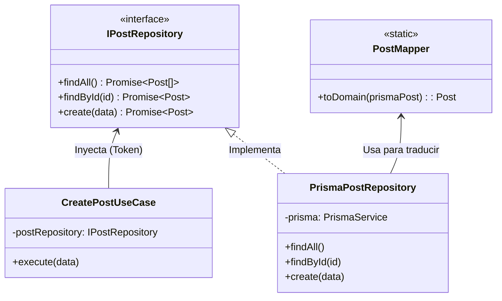

# Refactorización a Clean Architecture - AC_06

Este documento detalla el análisis, los problemas identificados y la solución arquitectónica implementada para migrar el proyecto hacia **Clean Architecture**, cumpliendo con los principios SOLID (especialmente el Principio de Inversión de Dependencias - DIP).

---

## 1. Problemas Identificados en el Código Original

Al analizar el código fuente entregado, identificamos las siguientes falencias arquitectónicas:

1. **Alto Acoplamiento con la Base de Datos (Prisma):** Los servicios (`PostsService`, `CommentsService`, etc.) importaban y utilizaban directamente `PrismaService` y los tipos generados por `@prisma/client`. Si la base de datos o el ORM cambiaban, toda la lógica de negocio se rompía.
2. **Lógica de Negocio en Controladores:** Los controladores HTTP tenían responsabilidades de orquestación y reglas de negocio, violando el Principio de Responsabilidad Única (SRP).
3. **Falta de Entidades de Dominio:** El sistema operaba con los modelos anémicos de la base de datos en lugar de tener entidades puras de TypeScript que representaran las reglas del negocio.
4. **Ausencia de Inversión de Dependencias (DIP):** Las capas superiores dependían directamente de implementaciones concretas de las capas inferiores, dificultando el testing aislado.

---

## 2. Solución Arquitectónica (Clean Architecture)

Para solucionar estos problemas, reestructuramos el proyecto en 4 capas bien definidas, con una regla de dependencia estricta (de afuera hacia adentro):

1. **Domain Layer (`src/domain/`):** Contiene las Entidades puras (`Post`, `Comment`, etc.), Value Objects y las **Interfaces de los Repositorios** (`IPostRepository`). No tiene dependencias externas.
2. **Application Layer (`src/application/`):** Contiene los **Casos de Uso** (`CreatePostUseCase`). Orquesta la lógica de negocio utilizando las interfaces del dominio, sin saber de HTTP ni de Prisma.
3. **Infrastructure Layer (`src/infrastructure/`):** Implementa los contratos del dominio. Aquí viven los repositorios concretos de Prisma y los Mappers.
4. **Presentation/HTTP Layer (`src/http/`):** Controladores y DTOs. Recibe peticiones, valida y llama a los Casos de Uso.

---

## 3. Implementación de la Capa de Infraestructura (Aporte Específico)

Como parte de la división de tareas, el **Integrante 2** se encargó de aislar completamente la base de datos del resto de la aplicación mediante la **Capa de Infraestructura**.

### A. Patrón Repository e Inversión de Dependencias
Se crearon implementaciones concretas (ej. `PrismaPostRepository`) que cumplen con los contratos (`IPostRepository`) definidos en el Dominio. La capa de Aplicación inyecta estos repositorios mediante **Tokens de Inyección** (`Symbol`), logrando que el Caso de Uso nunca conozca a Prisma.

### B. Patrón Data Mapper
Para evitar que los tipos de `@prisma/client` se filtren a la lógica de negocio, se implementaron **Mappers** (`PostMapper`, `CategoryMapper`, etc.). Estos se encargan de traducir los registros de la base de datos a Entidades puras del Dominio, manejando de forma segura nulos y relaciones.

### Diagrama de Clases: Inversión de Dependencias (DIP)



### Código Resumido: Implementación de Infraestructura

#### 1. El Mapper (Aislamiento de Prisma)

```typescript
// src/infrastructure/persistence/mappers/post.mapper.ts
export class PostMapper {
  static toDomain(prismaPost: PrismaPostWithRelations): Post {
    return new Post(
      prismaPost.id,
      prismaPost.title,
      prismaPost.description, // Traduce 'description' (DB) a 'content' (Dominio)
      prismaPost.imageUrl,
      prismaPost.categoryId ?? '', // Null safety
      prismaPost.createdAt,
      prismaPost.updatedAt
    );
  }
}
```

#### 2. El Repositorio Concreto

```typescript
// src/infrastructure/persistence/repositories/post.repository.ts
@Injectable()
export class PrismaPostRepository implements IPostRepository {
    constructor(private readonly prisma: PrismaService) {}

    async create(data: Pick<Post, "title" | "content" | "categoryId">): Promise<Post> {
        const created = await this.prisma.post.create({
            data: {
                title: data.title,
                description: data.content,
                categoryId: data.categoryId || null,
            }
        });
        return PostMapper.toDomain(created); // Retorna entidad pura
    }
}
```

#### 3. Inyección de Dependencias (Wiring)

```typescript
// src/infrastructure/infrastructure.module.ts
@Module({
    providers: [
        {
            provide: POST_REPOSITORY, // Token del Dominio
            useClass: PrismaPostRepository, // Implementación concreta
        }
    ],
    exports: [POST_REPOSITORY]
})
export class InfrastructureModule {}
```

---

## 4. Conclusión y Beneficios Obtenidos

Gracias a esta refactorización:

- **Testabilidad:** Ahora es posible probar los Casos de Uso (`GetFeedPostsUseCase`, etc.) inyectando repositorios falsos (Mocks en memoria), sin necesidad de levantar SQLite.
- **Mantenibilidad:** Si en el futuro se requiere cambiar SQLite por PostgreSQL o MongoDB, solo se modificará la capa de Infraestructura. El Dominio y los Casos de Uso permanecerán intactos.
- **Integridad de Datos:** Los Mappers garantizan que la aplicación siempre trabaje con datos válidos y tipados estrictamente, eliminando errores de null o undefined en tiempo de ejecución.
- **Cumplimiento de GitHub Actions:** El código refactorizado pasa exitosamente todos los linters, formateadores y la suite de 32 tests de integración.